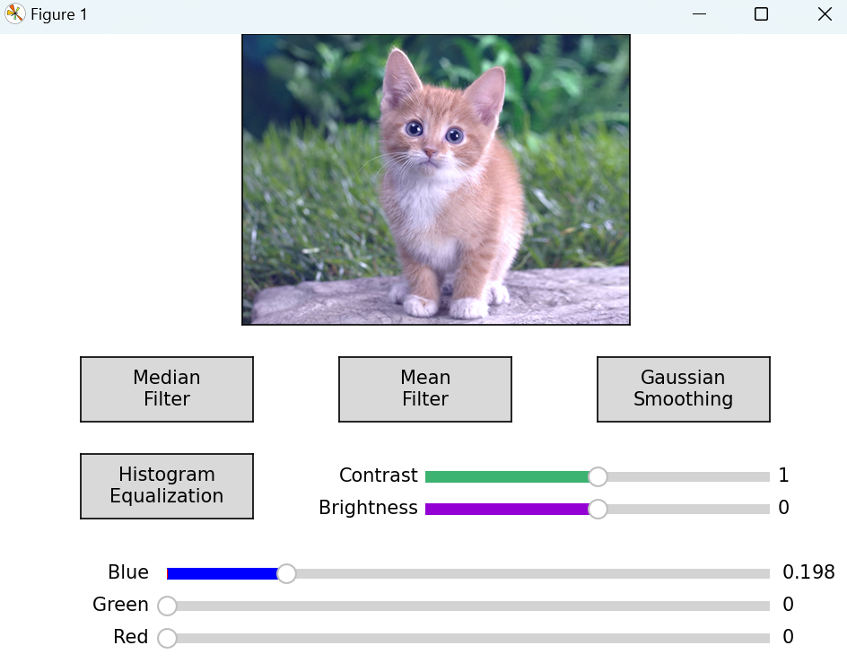
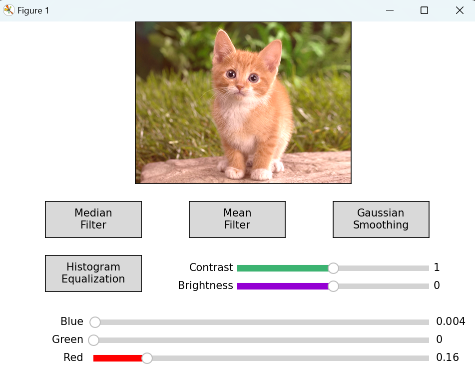

# ComputerVision_Workshop

## Information: 
```
Subject: CPV301 - Computer Vision
Advisor: Bui Van Hieu
Student: Pham Anh Nguyet
ID: HE176392
ClassID: AI1706
University: FPT University
```
## About this repository (Overview):
```
Lab 1: Geometric primitives and transformations
Lab 2: Image processing
Lab 5: Feature-Based Alignment
Lab 7: Object detection- Face detection
```
## About this repository (In-depth):
### [Lab 1](https://github.com/phamnguyet2003/ComputerVision_Workshop/tree/main/Lab1):
#### Geometric primitives and transformations:
- Function 1:  Create a white background 
- Function 2: Use the mouse to click on a coordinate p1(x1,y1), drag to the position p2(x2,y2) then release the mouse to draw a rectangle corresponding to 2 coordinates p1(x1,y1) and p2(x2, y2). cv.EVENT_LBUTTONDOWN:
- Function 3:. Select translation transformation: enter translation information to create a new rectangle corresponding to the new coordinates.
- Function 4: select rotation transform: enter rotation angle information to create a new rectangle corresponding to the new coordinates.
- Function 5: Select the scaling transformation: enter the scaling factors information to draw a new rectangle corresponding to the new coordinates.
#### Demo:


### [Lab 2](https://github.com/phamnguyet2003/ComputerVision_Workshop/tree/main/Lab2):
#### Image processing
- Function 1: color balance, to perform this function, the user needs to enter the necessary parameters to perform color balance. (can use the slider to represent it visually)
- Function 2: Show histogram and enter the necessary information to perform histogram equalization.
- Function 3: implement the median filter to remove noise in the image(salt and pepper noise)
- Function 4: implement the Mean filter to remove noise in image (salt and pepper noise)
- Function 5: implement Gaussian smoothing to perform image smoothing.
#### Demo:
- UI of this workshop:


- Some Activities:
Mean Filter:


Median Filter:


Gaussian Smoothing:


Histogram Equalization:


Contrast_Brightness Control:


Color Adjust:





### [Lab 5](https://github.com/phamnguyet2003/ComputerVision_Workshop/tree/main/Lab5): Click [here](https://github.com/phamnguyet2003/ComputerVision_Workshop/blob/main/Lab5/Demo%20Product.pdf) to see the demo result!

#### Feature-Based Alignment
- Function 1: RANdom SAmple Consensus- RANSAC is a parameter estimation approach designed to cope with a large proportion of outliers in the input data. RANSAC is a resampling technique that generates candidate solutions by using the minimum number of data points required to estimate the underlying model parameters. You are required to implement a RANSAC algorithm for image alignment based features.

#### Demo:
- Starting:


- Choose Template Image:


- Choose Check Image:


- Matches Point:


- Aligned Image:


### [Lab 7](https://github.com/phamnguyet2003/ComputerVision_Workshop/tree/main/Lab%207):
#### Object detection- Face detection
- Function : Haar Cascade. The algorithm uses edge or line detection features. These features on the image make it easy to find out the edges or the lines in the image or to pick areas where there is a sudden change in the intensities of the pixels. The haar calculation is done by finding out the difference of the average of the pixel values at the darker region and the average of the pixel values at the lighter region. If the difference is close to 1, then there is an edge detected. You are required to implement the Haar Cascade algorithm to perform face detection in the input image.

#### Demo:
- Starting UI:


- Test Image:


- Face Recognition:


